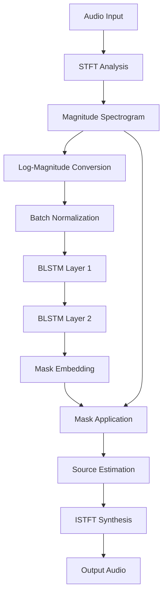

# Vocal Extraction from Songs: AI-Powered Audio Source Separation

## Acknowledgments

This project is built upon the excellent work from the **Source Separation Tutorial** repository:
- **Repository**: [https://github.com/source-separation/tutorial](https://github.com/source-separation/tutorial)
- **Website**: [https://source-separation.github.io](https://source-separation.github.io)

The core architecture and methodology follow the tutorial's approach, with additional enhancements and contributions detailed below.

### Key Contributions

This implementation addresses [Issue #46](https://github.com/source-separation/tutorial/issues/46) in the original tutorial repository by providing a **workaround for loading saved PyTorch models**. The solution includes manual model loading and proper metadata handling:

```python
# Workaround for saved pytorch models - addresses tutorial issue #46
separator.device = processing_device
separator.model = model
separator.config = loaded_model['metadata']['config']
separator.metadata.update(loaded_model['metadata'])
separator.transform = separator._get_transforms(loaded_model['metadata']['train_dataset']['transforms'])
```

**Special thanks to [@emilykuowen](https://github.com/emilykuowen)** for providing the initial hint that led to this solution.

## Table of Contents
1. [Project Overview](#project-overview)
2. [Theoretical Background](#theoretical-background)
3. [System Architecture](#system-architecture)
4. [Implementation Details](#implementation-details)
5. [API Documentation](#api-documentation)
6. [Usage Guide](#usage-guide)
7. [Performance Metrics](#performance-metrics)
8. [Dependencies and Requirements](#dependencies-and-requirements)

## Project Overview

This project implements an AI-powered audio source separation system specifically designed to extract vocals from music tracks. The system uses Bidirectional Long Short-Term Memory (BLSTM) Recurrent Neural Networks to learn time-frequency masking patterns that can isolate vocal components from complex musical mixtures.

### Key Features
- **Deep Learning Approach**: Uses BLSTM RNNs for temporal pattern recognition
- **Time-Frequency Masking**: Applies learned masks to spectrograms for source separation
- **Data Augmentation**: Implements coherent and incoherent mixture generation
- **GPU Acceleration**: NVIDIA CUDA support for efficient training
- **Comprehensive Evaluation**: Multiple audio quality metrics (SI-SDR, SD-SDR, etc.)

## Theoretical Background

### Audio Source Separation

Audio source separation is the process of isolating individual audio sources from a mixture, enabling independent processing and modification of each component. In the context of music, this involves separating vocals, drums, bass, and other instruments from a stereo mix.

### Dataset: MUSDB18

This project utilizes the **MUSDB18 dataset** for training and evaluation. MUSDB18 is a dataset of 150 full length music tracks (~10h total duration) of varying genres specifically designed for music source separation research.

#### Dataset Composition

For each track it provides:
- The mixture
- And the following stems: Drums, Bass, Vocals, Other

The "other" stem contains all sources in the mix that are not drums, bass, or vocals (such as guitars, keyboards, and other instruments). All audio signals in the dataset are stereo and encoded at a sampling rate of 44.1 kHz. The mixture signal is identical to the sum of the stems.

#### Dataset Structure

The full dataset is divided into train and test folders with 100 and 50 songs respectively. As their names suggest, the former should be used for model training and the latter for model evaluation.

For this tutorial implementation, we use 7-second clips from MUSDB18 rather than the full tracks, which are automatically downloaded via the nussl library.

#### Data Sources

The data in MUSDB18 is compiled from multiple sources:
- the DSD100 dataset,
- the MedleyDB dataset,
- the Native Instruments stems pack,
- and the The Easton Ellises - heise stems remix competition.

#### Licensing and Citation

MUSDB18 can be used for academic purposes only, with multiple of its tracks licensed under a Creative Commons Non-Commercial Share Alike license (BY-NC-SA).

The dataset was created by Zafar Rafii, Antoine Liutkus, Fabian-Robert Stöter, Stylianos Ioannis Mimilakis, and Rachel Bittner. When using this implementation, please cite the dataset as:

```bibtex
@misc{musdb18,
    author = {Rafii, Zafar and
              Liutkus, Antoine and
              Fabian-Robert St{\"o}ter and
              Mimilakis, Stylianos Ioannis and
              Bittner, Rachel},
    title = {The {MUSDB18} corpus for music separation},
    month = dec,
    year = 2017,
    doi = {10.5281/zenodo.1117372},
    url = {https://doi.org/10.5281/zenodo.1117372}
}
```

### Signal Analysis

The system operates on **time-frequency spectrograms** because they provide a representation that captures both temporal and spectral information:

- **Temporal Aspect**: Captures variations and changes in the audio signal over time, including dynamics, rhythm, and timing
- **Spectral Aspect**: Represents the distribution of frequencies present in the audio signal, revealing characteristics such as pitch, timbre, and harmonics

### Short-Time Fourier Transform (STFT)

The STFT is the core transformation used in this system:

1. **Windowing**: Divide the input signal into overlapping segments
2. **Window Function**: Apply a Hann window to each segment to reduce spectral leakage
3. **Fourier Transform**: Perform FFT on each windowed segment
4. **Spectrum Extraction**: Obtain magnitude and phase information

### Masking Technique

The system uses **time-frequency masking** where:
- A mask (matrix matching spectrogram shape) is applied element-wise
- The mask is multiplied with the original spectrogram to estimate the source
- **Binary masks** and **soft masks** are supported
- The neural network learns to predict appropriate masks

### Phase Reconstruction

Since the system operates on magnitude spectrograms, phase information is handled through:
- Using the phase component of the original mixture
- Applying the Griffin-Lim algorithm for phase reconstruction
- Direct waveform estimation techniques

## System Architecture

### Model Architecture

The system implements a **waveform-in/waveform-out** architecture with the following components:

```
Input Audio → STFT → Log-Magnitude → Normalization → BLSTM Stack → Mask Prediction → Source Estimation → Output Audio
```

#### Core Components:
1. **Amplitude to dB Conversion**: Converts magnitude spectrograms to log-magnitude (matching human auditory perception)
2. **Batch Normalization**: Normalizes input features for stable training
3. **Bidirectional LSTM Stack**: Two layers of BLSTM for temporal pattern recognition
4. **Mask Embedding**: Converts LSTM output to time-frequency masks
5. **Source Estimation**: Applies masks to original mixture for source separation

### Data Flow



## Implementation Details


### Data Augmentation Strategy

The system implements sophisticated data augmentation to address the scarcity of labeled music datasets:

#### Mixture Types:
1. **Coherent Mixtures**: Stems from the same song with identical time offsets (musically meaningful)
2. **Incoherent Mixtures**: Stems from different songs with random time offsets (increases diversity)

#### Augmentation Parameters:
- **Pitch Shift**: ±2 semitones
- **Time Stretch**: 0.8x to 1.2x speed
- **SNR Variation**: -5dB to +5dB
- **Temporal Offset**: Random 0-7 second offsets

### Training Process

1. **Preprocessing**: Convert magnitude spectrograms to log-magnitude
2. **Normalization**: Apply batch normalization to stabilize training
3. **Feature Extraction**: Process through BLSTM stack
4. **Mask Generation**: Convert LSTM outputs to binary masks
5. **Loss Calculation**: L1 loss between predicted and ground truth magnitudes

### Model Parameters

- **STFT Parameters**: 512-point window, 128-point hop, sqrt_hann window
- **Network Architecture**: 2 BLSTM layers, 50 hidden units, bidirectional
- **Training**: Adam optimizer, 1e-3 learning rate, 0.3 dropout
- **Batch Size**: 10 samples per batch
- **Epochs**: 25 epochs for full training

## API Documentation

### Core Classes

#### `MaskInference`

The main neural network model for vocal extraction.

```python
class MaskInference(nn.Module):
    def __init__(self, num_features, num_audio_channels, hidden_size,
                 num_layers, bidirectional, dropout, num_sources,
                 activation='sigmoid')
```

**Parameters:**
- `num_features` (int): Number of frequency bins (window_length // 2 + 1)
- `num_audio_channels` (int): Number of audio channels (1 for mono)
- `hidden_size` (int): Hidden state size for LSTM layers
- `num_layers` (int): Number of LSTM layers
- `bidirectional` (bool): Whether to use bidirectional LSTM
- `dropout` (float): Dropout probability for regularization
- `num_sources` (int): Number of sources to separate
- `activation` (str): Activation function for mask ('sigmoid' or 'softmax')

**Methods:**

##### `forward(data)`
Performs forward pass through the network.

**Parameters:**
- `data` (torch.Tensor): Input magnitude spectrogram

**Returns:**
- `dict`: Dictionary containing:
  - `mask`: Predicted time-frequency mask
  - `estimates`: Estimated source magnitudes

##### `build(cls, **kwargs)` (Class Method)
Builds and registers the model with nussl framework.

**Returns:**
- `nussl.ml.SeparationModel`: Configured separation model

### Data Augmentation Functions

#### `generate_coherent_mixture(foreground_dir, background_dir, template, seed)`

Generates coherent mixtures where all stems come from the same song.

**Parameters:**
- `foreground_dir` (str): Path to foreground audio files
- `background_dir` (str): Path to background audio files  
- `template` (dict): Event template configuration
- `seed` (int): Random seed for reproducibility

**Returns:**
- `tuple`: (mixture_audio, mixture_jam, annotation_list, stem_audio_list)

#### `generate_incoherent_mixture(foreground_dir, background_dir, template, seed)`

Generates incoherent mixtures with stems from different songs.

**Parameters:**
- Same as `generate_coherent_mixture`

**Returns:**
- Same as `generate_coherent_mixture`

#### `create_mix_closure(path, subset)`

Creates a mix closure function for dataset generation.

**Parameters:**
- `path` (str): Path to store dataset
- `subset` (str): Dataset subset ('train', 'valid', 'test')

**Returns:**
- `MixClosure`: Callable object for generating mixtures

### Main Functions

#### `train_model(maximum_number_of_mixtures=1000)`

Trains the vocal extraction model.

**Parameters:**
- `maximum_number_of_mixtures` (int): Maximum number of training mixtures

**Features:**
- Automatic GPU/CPU detection
- Data augmentation pipeline
- Validation monitoring
- Model checkpointing

#### `evaluate_model(path_to_trained_model='checkpoints/best.model.pth')`

Evaluates trained model on test dataset.

**Parameters:**
- `path_to_trained_model` (str): Path to saved model checkpoint

**Outputs:**
- JSON files with evaluation scores
- Aggregated performance report

#### `create_model()`

Creates and configures the MaskInference model.

**Returns:**
- `MaskInference`: Configured model instance

## Usage Guide

### Installation

1. **Install Dependencies**:
```bash
pip install -r requirements.txt
```

2. **Environment Setup**:
   - Ensure CUDA is available for GPU acceleration
   - Set Sox and FFMPEG environment variables

3. **Dataset Preparation**:
   - The system automatically downloads MUSDB18 dataset
   - Dataset is organized into train/validation/test splits

### Training

```python
# Basic training with default parameters
from main import train_model
train_model()

# Training with custom mixture count
train_model(maximum_number_of_mixtures=2000)
```

### Evaluation

```python
# Evaluate with default checkpoint
from main import evaluate_model
evaluate_model()

# Evaluate with custom model
evaluate_model('path/to/custom/model.pth')
```

### Interactive Usage

Run the main script for interactive menu:

```bash
python main.py
```

Options:
1. Train MaskInference model
2. Evaluate model with test set
3. Evaluate with pretrained model
4. Exit

### Custom Model Configuration

```python
from model import MaskInference

# Create custom model
model = MaskInference.build(
    num_features=257,           # For 512-point STFT
    num_audio_channels=1,       # Mono audio
    hidden_size=100,            # Larger hidden state
    num_layers=3,               # More LSTM layers
    bidirectional=True,         # Bidirectional processing
    dropout=0.2,                # Lower dropout
    num_sources=1,              # Single source (vocals)
    activation='sigmoid'        # Sigmoid activation
)
```

## Performance Metrics

The system uses multiple evaluation metrics to assess separation quality:

### Scale-Invariant Metrics
- **SI-SDR**: Scale-Invariant Signal-to-Distortion Ratio
- **SI-SIR**: Scale-Invariant Signal-to-Interference Ratio  
- **SI-SAR**: Scale-Invariant Signal-to-Artifacts Ratio

### Scale-Dependent Metrics
- **SD-SDR**: Scale-Dependent Signal-to-Distortion Ratio
- **SNR**: Signal-to-Noise Ratio
- **SRR**: Signal-to-Reverberation Ratio

### Benchmark Results

**After 25 epochs, 32 items per batch:**

| Metric | Overall | Bass+Drums+Other | Vocals |
|--------|---------|------------------|---------|
| SI-SDR | 3.93 ± 3.86 | 6.79 ± 2.36 | 1.08 ± 2.81 |
| SI-SIR | 9.43 ± 3.81 | 10.87 ± 3.15 | 7.99 ± 3.92 |
| SI-SAR | 5.71 ± 4.31 | 9.22 ± 2.24 | 2.20 ± 2.67 |

**Key Performance Indicators:**
- **Vocal Separation SD-SDR**: 10.47dB average improvement
- **Compared to Random**: 81.48% SD-SDR improvement, 128% SI-SDR improvement
- **Training Efficiency**: Convergence within 25 epochs

## Dependencies and Requirements

### Core Dependencies

```
numpy==1.22.3        # Numerical computing
nussl==1.1.9         # Audio source separation library
scaper==1.6.5        # Audio scene synthesis
torch==1.11.0+cu113  # PyTorch with CUDA support
```

### System Requirements

- **Python**: 3.7+
- **CUDA**: Compatible NVIDIA GPU (optional but recommended)
- **Memory**: 8GB+ RAM for training
- **Storage**: 10GB+ for datasets and checkpoints

### Additional Tools

- **Sox**: Audio processing library
- **FFMPEG**: Multimedia framework
- **CUDA Toolkit**: For GPU acceleration

### Hardware Recommendations

**Minimum Configuration:**
- CPU: Intel i5 or AMD Ryzen 5
- RAM: 8GB
- GPU: NVIDIA GTX 1060 or equivalent
- Storage: 20GB available space

**Recommended Configuration:**
- CPU: Intel i7/i9 or AMD Ryzen 7/9
- RAM: 16GB+
- GPU: NVIDIA RTX 3070 or better
- Storage: SSD with 50GB+ available space

## File Structure

```
vocal-extraction/
├── main.py                    # Main execution script
├── model.py                   # Neural network implementation
├── data_augmentation.py       # Data augmentation utilities
├── requirements.txt           # Python dependencies
├── .gitignore                # Git ignore rules
├── dataset/                   # Generated datasets
│   ├── train/
│   ├── valid/
│   └── test/
├── checkpoints/              # Model checkpoints
├── evaluation_results/       # Evaluation outputs
└── pretrained_model/        # Pre-trained models
```

## Technical Contributions

### PyTorch Model Loading Fix

This implementation provides a solution to the model loading issue identified in the source separation tutorial. The workaround manually reconstructs the separator object with proper device assignment and metadata handling:

```python
def evaluate_model(path_to_trained_model='checkpoints/best.model.pth'):
    loaded_model = torch.load(path_to_trained_model, map_location=processing_device)
    model = create_model()
    model.load_state_dict(loaded_model['state_dict'])
    
    separator = nussl.separation.deep.DeepMaskEstimation(
        nussl.AudioSignal(), model_path=None,
        device=processing_device,
    )
    
    # Manual model loading workaround - fixes tutorial issue #46
    separator.device = processing_device
    separator.model = model
    separator.config = loaded_model['metadata']['config']
    separator.metadata.update(loaded_model['metadata'])
    separator.transform = separator._get_transforms(loaded_model['metadata']['train_dataset']['transforms'])
```

This solution ensures that:
- Model device assignment is correctly handled
- Configuration metadata is properly restored
- Transform pipeline is reconstructed from saved metadata
- Evaluation can proceed without serialization errors

## Contributing

When contributing to this project:

1. **Code Style**: Follow PEP 8 guidelines
2. **Documentation**: Update docstrings and comments
3. **Testing**: Ensure compatibility with different hardware configurations
4. **Performance**: Profile code for efficiency improvements
5. **Attribution**: Give proper credit to original sources and collaborators

## Future Enhancements

Potential improvements for the system:

1. **Real-time Processing**: Implement streaming inference
2. **Multi-instrument Separation**: Extend to separate multiple instruments
3. **Attention Mechanisms**: Add attention layers for better focus
4. **Advanced Augmentation**: Implement more sophisticated data augmentation
5. **Model Compression**: Optimize for mobile/edge deployment

---

*This documentation covers the complete vocal extraction system. For additional support or questions, please refer to the nussl documentation or contact the development team.*